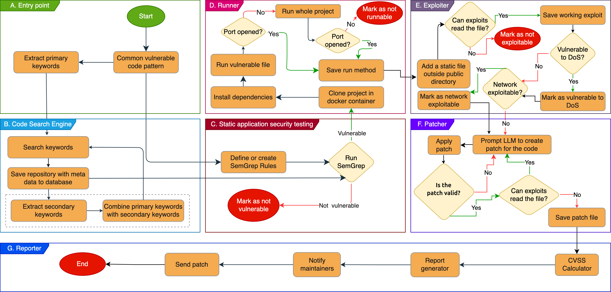

<h1 align="center">Dot Dot Defender</h1>


<p align="center">

</p>


The story starts after I discovered the [CVE-2023-39141](https://gist.github.com/JafarAkhondali/528fe6c548b78f454911fb866b23f66e), and realized the vulnerable code is spreaded EVERYWHERE. As it was technically infeasible for me to check & report manually, we decided to team up and implement a pipeline to Find, Verify SAST, DAST(0 false positives via auto running), Assess CVSS scores, Fix(GPT-4), Patch and send Pull Requests, fully automatically.


## Full paper:
You can access the paper [Eradicating the Unseen: Detecting, Exploiting, and Remediating a Path Traversal Vulnerability across GitHub](https://dl.acm.org/doi/10.1145/3708821.3736220)  
_Jafar Akhoundali, Hamidreza Hamidi, Kristian Rietveld, Olga Gadyatskaya - Published in Asia CCS 2025_

### Citation:
Please cite the paper as:   
```latex
@inproceedings{akhoundali2025eradicating,
  title={Eradicating the Unseen: Detecting, Exploiting, and Remediating a Path Traversal Vulnerability across GitHub},
  author={Akhoundali, Jafar and Hamidi, Hamidreza and Rietveld, Kristian and Gadyatskaya, Olga},
  booktitle={Proceedings of the 20th ACM Asia Conference on Computer and Communications Security},
  pages={542--558},
  year={2025}
}
```

## ⚠️ Disclaimer

This project is provided **strictly for research and educational purposes only**.

- Do **not** attempt to send issues, vulnerability reports, or patches to repositories that have **already received a report from us**.  
  This is partially automated in the code, so please **make sure you understand each module before execution**.  
- The authors take **no responsibility** for any misuse of this project.  
- Vulnerable code is executed inside Docker containers. It is **expected to be safe**, but there is **no absolute guarantee**.  
- Although the source code of this pipeline is free to use, parts related to SAST (SemGrep and CodeQL) may have **different licenses** depending on your usage.  
  It is the user’s responsibility to verify and comply with all applicable license agreements.  

---

## 🔧 Installation

This program was developed and tested on **GNU/Linux**, and partially tested on **macOS**.  
**Windows/WSL are not tested nor recommended.** Running the project inside a docker container(DIND) is not recommended as this way the nested containers can bypass the sandbox.

Please read the instructions carefully before running the program, as incorrect usage may result in **spamming reports**.  

Requirements:  
- Docker and Docker Compose installed and available in your CLI.  
- Pipeline must run either as **root** (recommended for Docker commands), or with Docker accessible to the current user (⚠️ this may reduce security).  
- CodeQL and Semgrep must be installed.  

```bash
# Clone repo
git clone https://github.com/JafarAkhondali/DotDotDefender.git
cd DotDotDefender

# Configure environment variables
cp env.example .env
nano .env 

# Run database image
sudo docker-compose up -d

# Set up Python environment 
python3 -m venv venv

# Below 3 steps must be done for each time you want to run the code
source ./venv/bin/activate
export PYTHONPATH=$(pwd)
pip3 install -r requirements.txt

# Install CodeQL - https://github.com/github/codeql-action/releases
# Install SemGrep CLI - https://semgrep.dev/docs/cli-reference
```

## Usage

This program consists of several components. Each one is designed to run independently, contributing to the overall pipeline:

1. **Scraper**  
   Searches for specific patterns of vulnerable code using GitHub Code Search feature.  
   File: `scrapper/recursive-scrapper.py`

2. **Static Analysis**  
   Validates the vulnerability by running **SemGrep** with specific payloads.  
   File: `sast/grep.py`

3. **PoC Checker**  
   Executes the program with the payload.  
   - Must be run as **root** for Docker commands.  
   - There are 3 different PoC checkers — **all must be run** to complete this step:  
     - `run-poc-network.py`  
     - `run-poc-local.py`  
     - `run-poc-dos.py`

4. **Reporter (Scoring & Patching)**  
   - Calculates CVSS Score → `calculate_cvss_scores.py`  
   - Prepares a fix using GPT-4 → `patcher.py`

5. **Reporter (Verification & Patch Application)**  
   - Verifies the vulnerability still exists → `patcher.py`  
   - Applies a verified patch using an LLM.

6. **Pull Requester (Commit History)**  
   Retrieves the time when the first vulnerable commit appeared.  
   File: `add_first_appeared.py`

7. **Pull Requester (PR Submission)**  
   ⚠️ **Warning**: If you are testing, **DO NOT RUN** `run.py` - it will re-verify the patch and send an actual pull request.


## Sample generated patch


## LLM contamination
This figure illustrates how training data from vulnerable repositories can contaminate LLM outputs, causing the reproduction of insecure code patterns(more details in paper).


## 🤝 Contributing
We welcome contributions to improve **DotDot Defender**! Morover you are more than welcome to maintain your own fork and research.

If you’d like to add features, fix bugs, or improve documentation, please follow these steps:  
1. Fork it!
2. Create your feature branch: `git checkout -b my-new-feature`
3. Commit your changes: `git commit -am 'Add some feature'`
4. Push to the branch: `git push origin my-new-feature`
5. Submit a pull request

## License
Although the source code of this pipeline is free to use, parts related to SAST (SemGrep and CodeQL) may have **different licenses** depending on your usage.  It is the user’s responsibility to verify and comply with all applicable license agreements.  


## Star History

[](https://star-history.com/#JafarAkhondali/DotDotDefender&Date)

